# Hey, I'm Aung Kyaw Min Htet 👋

  

  

  
  
  

  
  
  
  

---

## About

I build web applications, real-time monitoring systems, and dashboard products that focus on clarity, speed, and practical outcomes.

I am a Software Engineering student at Mae Fah Luang University, Thailand, with experience across full-stack development, IoT integration, and embedded systems.

  

<table>
  <tr>
    <td width="50%" valign="top">
      <strong>Currently focused on</strong> 
       
      - Hospital transport real-time monitoring 
      - Next.js, Node.js, and React workflows 
      - Cloud-ready system design 
      - AI exploration with Python
    </td>
    <td width="50%" valign="top">
      <strong>Open to</strong> 
       
      - Full-stack applications 
      - Dashboard systems
      - Real-time products
      - Collaboration with practical teams
    </td>
  </tr>
</table>

---

## Selected Work

  A more visual showcase of the work I want to be known for.

<table>
  <tr>
    <td width="62%" valign="top" rowspan="2">
      
        
      <strong>01 / Hospital Transport Real-Time Monitoring System</strong>
       
      Real-time platform for improving transport visibility and operational efficiency.
        
      <strong>Highlights</strong>
       
      - Live operational monitoring 
      - Faster issue detection 
      - Clean dashboard workflow
        
      <strong>Stack</strong>
       
      
      
      
    </td>
    <td width="38%" valign="top">
      
        
      <strong>02 / Oil Management System Dashboard</strong>
       
      Dashboard for monitoring wells, tanks, workers, and expenses.
        
      <strong>Stack</strong>
       
      
      
      
    </td>
  </tr>
  <tr>
    <td width="38%" valign="top">
      
        
      <strong>03 / Admin Dashboard & Real-Time Data Platform</strong>
       
      Scalable dashboard for monitoring, analytics, and operational control.
        
      <strong>Stack</strong>
       
      
      
      
    </td>
  </tr>
</table>

---
name: Aung Kyaw Min Htet
github: aungkyawminhtet
cohort: 1
---

## Achievements

- Fighting Robot Competition — First Prize, MakerFest Myanmar 2019
- On-Water Robot Competition — First Runner-Up
- Automatic Fire Fighting Robot Project — APT Young Professionals Program
- MediHack Hackathon 2026 — AI for Healthcare Solutions

---

## GitHub Stats

  A quick snapshot of the work I ship and the tools I use most.

  

---

## Connect

  <a href="https://www.linkedin.com/in/aung-kyaw-min-htet-3b359b23b/">LinkedIn</a> ·
  <a href="https://www.facebook.com/aungkyawminhtet.sbo">Facebook</a> ·
  <a href="https://github.com/aungkyawminhtet">GitHub</a> ·
  <a href="mailto:aungkyawminhtet.sbo@gmail.com">Email</a>

  Always learning, building, and shipping software that feels fast and useful.

